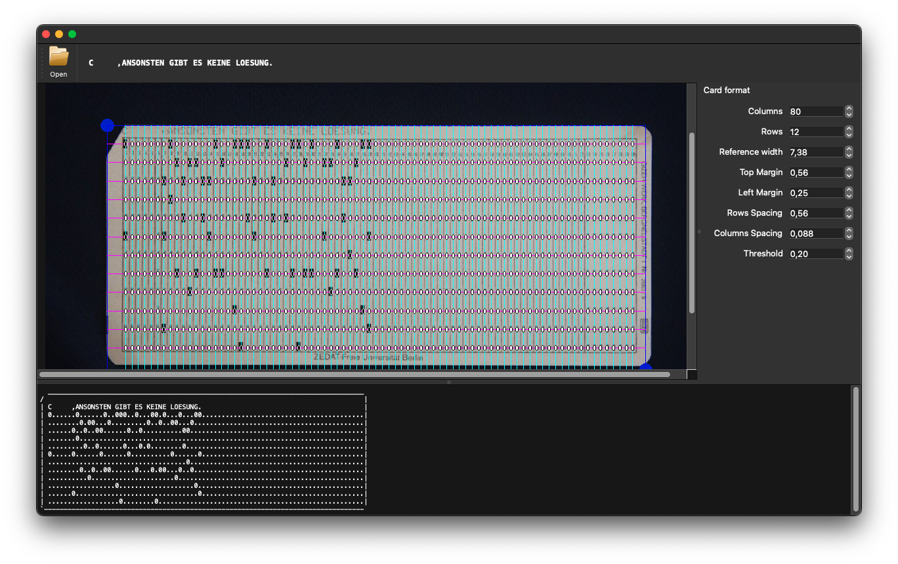

Punchcard decoder
=================

This is a simple proof of concept decoder of punched cards from images.

Requires Qt, which can be installed, even in a virtual environment like so:

```
    $ python3 -mvenv env
    $ . env/bin/activate
    $ pip install PySide6
    $ python card.py
```

Usage
-----

Load an image, then align the grid until it matches the punched holes in
the picture.

A card representation show the currently recognised data, along with a
possible interpretation using known encodings.



References
----------

- [Punch Card Reader](http://codeincluded.blogspot.com/2012/07/punchcard-reader-software.html)
  at Code Included
- [The Punched Card](http://www.quadibloc.com/comp/cardint.htm) at
  quadibloc.com

